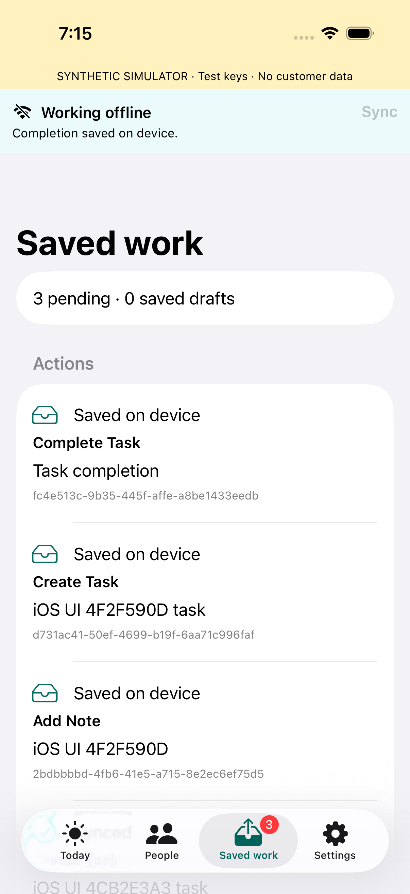
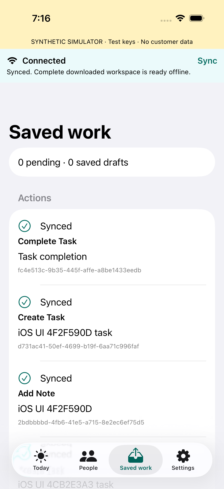

# Mobile 001 — iOS verification

**Native implementation checkpoint; synthetic verification passed.** This is an
actual SwiftUI iPhone app, not Web/CLI substitution. Root's follow-up backend
terminal-generation lifecycle fix and its bounded native repeated-sync check are
still pending at this checkpoint. Physical-device/cellular/distribution evidence
is not claimed.

## Scope and environment

Owned files: `ios/` and this record, based on integrated foundation `feab066`.
The contract is `docs/tasks/MOBILE_001_CONTRACT.md`; D-073–D-075 authorize this
isolated work. Source/evidence fingerprints are in
[`ios/evidence/checks.json`](../../ios/evidence/checks.json).

- Xcode 26.6 (17F113), command-scoped
  `DEVELOPER_DIR=/Applications/Xcode.app/Contents/Developer`.
- iPhone 17 Simulator `F5BF9C74-37AC-4546-A576-F30587CB4F4C`, iOS 26.5 (23F77).
- Official SQLCipher.swift 4.19.0, exact commit and checksum recorded in
  [`ios/README.md`](../../ios/README.md), with upstream license retained.
- Actual API `127.0.0.1:3101`, retained synthetic `crm_mobile_001` fixture: two
  Organizations, two actors, initial 100 People / 1,000 notes / 1,000 tasks. Test writes
  add uniquely labelled synthetic rows; these are not customer data. iOS writes
  use Person 080; Android reserved 020–025.
- Simulator uses an explicit Debug-only `--synthetic-keychain` flag and visible
  banner. Keys use a separate `WhenUnlockedThisDeviceOnly` namespace. Normal
  Simulator mode fails closed. Device key policy remains
  `WhenPasscodeSetThisDeviceOnly`, no synchronization or backup.

## Observed checks

| Check | Observed result | Evidence |
|---|---|---|
| Native Debug build | Passed; actual ARM64 Simulator app linked against SQLCipher | `/private/tmp/crm-ios-build3.log`; later signed test builds also passed |
| Final storage + model suite | **20 tests passed**, 14 storage / 6 model, zero failures | `/private/tmp/crm-ios-final-focused.log`; retained summary in `ios/evidence/` |
| Real API lost-response/100 actions | **Passed**, 100 durable queued/accepted actions | `/private/tmp/crm-ios-tests3.log`, `LiveAPITests`, 2.626s |
| Actual SwiftUI end-to-end | **Passed**, 60.438s | `/private/tmp/crm-ios-ui4.log`; native screenshots below |
| Device Release compile | **Passed**,ARM64 iOS device target | `/private/tmp/crm-ios-release1.log`; build only, no signing/distribution claim |

The final focused command was:

```sh
DEVELOPER_DIR=/Applications/Xcode.app/Contents/Developer xcodebuild \
  -project ios/FieldCRM.xcodeproj -scheme FieldCRM -configuration Debug \
  -destination 'id=F5BF9C74-37AC-4546-A576-F30587CB4F4C' \
  -derivedDataPath ios/.build test \
  -only-testing:FieldCRMTests/StorageTests -only-testing:FieldCRMTests/ModelTests \
  CODE_SIGN_IDENTITY=-
```

The live test used the same native XCTest target and `API`/`LocalStore` code,
with `-only-testing:FieldCRMTests/LiveAPITests`. It saved 98 notes, one task and
one dependent completion in a file-backed encrypted store, closed/reopened it,
verified all 100 exact envelopes, dropped a **real successful HTTP response after
server acceptance**, retried identical bytes and verified `replayed=true` and
the same resource ID. All100 receipts survived reopening. It also exercised
stale task revision, same-ID/different-payload refusal, cross-actor receipt 404,
and header/body context 401. It is separate from the controlled-response model
tests; those do not claim network/server verification.

`FieldFlowTests` used actual text fields/buttons in the running SwiftUI app:
sign-in, complete 100-person download, explicit offline switch assertion, note
autosave and submission, task creation and its local dependency completion,
**exactly 3 pending**, app termination/relaunch with the same 3 pending, resumed
sync to 0 pending, then sign-out removing the workspace UI. The final screenshot
also shows a complete synchronized download. XCTest result bundle:
`ios/.build/Logs/Test/Test-FieldCRM-2026.09.12_19-15-10--0700.xcresult`.
The two kept attachments were exported and visually inspected:





## What the focused tests establish

- Actual SQLCipher 4.19.0, encrypted header and WAL (no synthetic plaintext),
  wrong-key refusal, cipher integrity, WAL/FULL/temp-memory settings and backup
  exclusion. Keychain test persists/reopens an actual device-only item.
- Transactional schema 1→2→3 preservation and refusal of a future schema without
  recreating its file. A real SQLite page-limit `SQLITE_FULL` rolls back both
  attempted draft consumption and failed autosave; earlier saved input remains.
- Stale draft submission refusal; exact immutable envelopes despite retry;
  create-operation dependency; no synthetic server task ID.
- Accepted receipt before an older generation preserves its overlay; a causally
  covering complete bundle retires it; an older later promotion cannot lower
  the active Person revision. Interrupted pages/cursors reopen without partial
  publication or queue loss.
- Actor/Organization and context store mismatch refusal. Same-boot process
  restart lease persistence; expiry, reboot UUID change, wall rollback and
  monotonic rollback lock. `mach_continuous_time` includes device sleep; real
  physical-device sleep/reboot enforcement remains pending.
- A durable lock marker survives credential replacement failure and model
  reopening with pending input intact. Authoritative reconciliation 403 and
  operation 403 with failed authority recheck hide old cache and persist a lock.
  Task-specific 403 with a valid `/api/me` recheck keeps read access and marks the
  original action needs-attention.
- Unsupported protocol is persisted independently of the user pause toggle and
  cannot be cleared by toggling/relaunching. Retired-generation 404 discards only
  staging and reuses a complete bundle; operation 404 stays a needs-attention
  operation, with no new-ID retry.
- Cache reclamation preserves active/staged content, drafts and outbox. A
  fixture with 2,501 obsolete memberships, 401 pages and 151 bundles exceeds every
  batch size; repeated bounded batches drain fully before next generation
  admission. The app yields between batches.

## Review corrections and failure attribution

One bounded source review found six issues: sleep-excluding clock, ignored
credential replacement failure during lock,403 authority classification,
conflicted completion blocking a deliberate new proposal, growing obsolete
cache, and a user-clearable protocol stop. All were corrected; focused model
checks cover the security paths. A task composer now restores its due date;
Today displays its evaluation time and local task count. The refreshed-task
completion button uses the current downloaded revision and creates a separate
explicit action while retaining the original conflict.

Earlier failures are retained as attribution, not hidden success claims:

1. An unsigned Simulator build could not persist Keychain credentials. Using
   local ad-hoc signing fixed it; the actual Keychain test passes. The production
   key policy was not weakened.
2. UI2 tapped the center of a SwiftUI toggle row rather than its trailing
   control. It did not enter offline mode; its note really saved and synced.
   UI3/4 explicitly assert the switch value and offline label.
3. UI3 saved the note/task but its completion tap hit a button under the
   translucent navigation bar. The2-pending screenshot/video established the
   missing action. UI4 scrolls the control into the content area and preserves
   exact 3-pending assertions before/after process termination.
4. The first live run expected 400/404 for a mismatched header/body context;
   actual backend contract returned 401. The assertion was corrected and the
   complete live test passed; no server behavior was changed for the test.
5. Combined native runs exposed completed server generations consuming capacity
   until TTL. Root owns the backend correction. After iOS confirmed no active
   requests, root retired only obsolete synthetic test generations, preserving
   contexts/receipts/business rows. Native 404 recovery and 30s capacity pacing
   are implemented. A post-fix repeated-sync check remains separately pending.

## Limits and handoff

No live customer/FUB source, production deployment, app distribution, physical
phone, real poor cellular signal, uninstall/reinstall recovery or backup
restore was tested. A destroyed device/uninstalled database cannot recover
never-synced work. Real passcode/Secure Enclave/device restart and cellular
checks remain a release/device gate. Release has no approved production HTTPS
or signing environment. The technical iOS 17 floor is not a customer support
commitment. Background scheduling is deliberately not presented as guaranteed.

The root coordinator owns the backend lifecycle fix and final integrated
status. Native implementation and the evidence above can be integrated as a
local checkpoint without representing the whole Mobile 001 release as complete.
